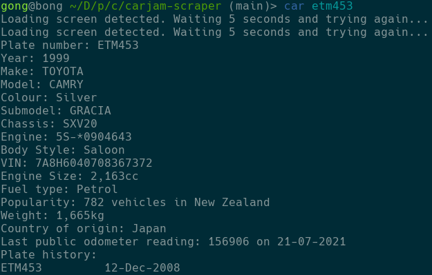

# Carjam scraper

This is something I made to learn C a bit better.
You give it a numberplate as a command-line argument, and it prints out nicely all the details it can find from the carjam.co.nz page.

Example:

Shoutout [Tinny](https://soundcloud.com/tinnietinskin) for making music that's very nice to write code to.
